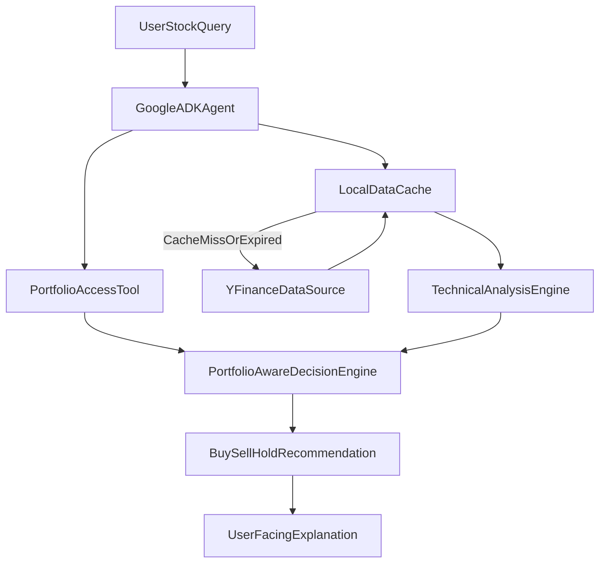

# Investment Agent Specification

## 1) Product Goal And Non-Goals

### Goal
Build a portfolio-aware investment analysis agent using Google ADK that:
- analyzes a user-selected stock with market data from `yfinance`,
- evaluates technical indicators and portfolio context,
- returns an actionable recommendation: `buy`, `hold`, or `sell`,
- explains the rationale and confidence clearly.

### Non-Goals
- High-frequency or intraday execution engine.
- Fully autonomous trading without user confirmation.
- Guarantee of profit or elimination of market risk.
- Fundamental-only investing workflow (fundamental signals can be optional enrichments).

### Decision-Support Disclaimer
This agent provides analytical guidance, not financial advice. Final investment decisions remain with the user.

## 2) System Architecture (Google ADK)

### Core Components
- `InvestmentAnalysisAgent` (ADK orchestrator): receives user request, orchestrates tool calls, and builds final recommendation.
- `PortfolioTool`: reads user portfolio holdings, constraints, and cash state.
- `MarketDataTool` (yfinance-backed): fetches OHLCV and optional metadata.
- `HistoricalDataCache`: local cache layer to avoid repeated historical downloads.
- `TechnicalAnalysisEngine`: computes indicators and normalized signals.
- `DecisionEngine`: fuses TA signals with portfolio constraints to produce recommendation.
- `RecommendationFormatter`: renders user-friendly output and machine-readable contract.

### ADK Tool-Calling Lifecycle
1. Parse user query: symbol, horizon, risk preference.
2. Pull current portfolio snapshot.
3. Resolve market data via cache-first retrieval.
4. Compute technical signals over selected windows.
5. Score `buy/hold/sell` with risk and allocation guardrails.
6. Return recommendation with confidence, evidence, and risk notes.

### High-Level Flow


## 3) Data Sources And Ingestion (yfinance)

### Primary Data Source
- Provider: `yfinance`.
- Primary endpoint patterns:
  - `Ticker(symbol).history(period=..., interval=...)`
  - optional: `Ticker(symbol).info`, `Ticker(symbol).fast_info`.

### Required Market Fields
- OHLCV: `Open`, `High`, `Low`, `Close`, `Volume`.
- Timestamp index in exchange timezone.
- Adjusted prices when needed for long-window indicator consistency.

### Suggested Fetch Windows
- Short-term analysis: `6mo` with `1d`.
- Swing/trend context: `1y` to `2y` with `1d`.
- Volatility/volume context: minimum `120` bars.

### Refresh Cadence
- Daily candles: refresh every market day (plus on-demand refresh when stale).
- Intraday usage (if enabled): short TTL and strict cache invalidation by interval.

## 4) Local Historical Data Caching

### Objectives
- Minimize repeated downloads for the same `(symbol, interval, period)`.
- Provide deterministic fallback behavior when network/data source is unavailable.

### Storage Design
- Location: local app data directory, for example `.cache/market_data/`.
- Format: Parquet or CSV per key.
- Metadata file per entry:
  - `symbol`
  - `interval`
  - `period`
  - `created_at`
  - `expires_at`
  - `row_count`
  - `source` (`yfinance`)

### Cache Key
`{symbol}_{interval}_{period}`

### TTL Policy (example defaults)
- `1d`: 6-24 hours.
- `1h`: 15-60 minutes.
- `15m`: 5-15 minutes.

### Cache Retrieval Logic
```python
def get_historical_data(symbol: str, interval: str, period: str):
    key = build_cache_key(symbol, interval, period)
    entry = cache.get(key)
    if entry and not entry.is_expired():
        return entry.data, {"cache": "hit"}

    fresh = yfinance_fetch(symbol=symbol, interval=interval, period=period)
    if fresh is not None and len(fresh) > 0:
        cache.put(key, fresh, ttl=ttl_for(interval))
        return fresh, {"cache": "miss_refreshed"}

    if entry is not None:
        return entry.data, {"cache": "stale_fallback"}

    raise DataUnavailableError(f"No historical data for {symbol}")
```

### Failure Handling
- If yfinance fails and cache exists: return stale cache with warning flag.
- If both fail: return no-trade recommendation (`hold`) with high uncertainty note.

## 5) Portfolio Access Model

### Required Portfolio Inputs
- `holdings`: list of positions with symbol, quantity, avg_cost, current_value.
- `cash_available`.
- `target_allocations` (optional).
- `risk_profile` (conservative/moderate/aggressive).
- Constraints:
  - max single-position concentration,
  - max sector concentration,
  - minimum cash buffer,
  - stop-loss policy configuration.

### Example Portfolio Payload
```json
{
  "base_currency": "USD",
  "cash_available": 12500.0,
  "risk_profile": "moderate",
  "constraints": {
    "max_position_weight": 0.2,
    "min_cash_buffer": 0.05
  },
  "holdings": [
    {"symbol": "AAPL", "quantity": 35, "avg_cost": 174.2, "market_value": 7200.0},
    {"symbol": "MSFT", "quantity": 12, "avg_cost": 401.5, "market_value": 4980.0}
  ]
}
```

### Access And Security Boundaries
- Portfolio tool should be read-only for recommendation mode.
- No trade placement capability by default.
- Restrict stored sensitive portfolio data to local encrypted storage.
- Log access events without exposing full sensitive payloads in plaintext logs.

## 6) Technical Analysis Toolset

All indicators should be implemented as modular, testable tools and grouped by category.

### Trend
- `SMA` (20, 50, 200)
- `EMA` (12, 26, 50)
- `WMA`
- `MACD` (line, signal, histogram)
- `ADX`
- `Ichimoku Cloud`

### Momentum
- `RSI`
- `Stochastic Oscillator` (`%K`, `%D`)
- `CCI`
- `ROC`
- `Williams %R`

### Volatility
- `ATR`
- `Bollinger Bands`
- `Keltner Channels`
- `Donchian Channels`

### Volume And Flow
- `OBV`
- `MFI`
- `VWAP` (when intraday data available)
- `Chaikin Money Flow`
- `Accumulation/Distribution Line`

### Market Structure
- Support and resistance zones.
- Pivot points.
- Breakout vs range detection.
- Trend regime classification (`uptrend`, `downtrend`, `sideways`).

## 7) Signal Fusion And Decision Engine

### Multi-Factor Scoring
Use weighted scoring to combine:
- Technical score (`0-100`): trend + momentum + volatility + volume.
- Portfolio fit score (`0-100`): diversification impact, concentration limits, cash impact.
- Risk-adjusted conviction (`0-100`): volatility, drawdown sensitivity, and trend stability.

Example blended score:
`final_score = 0.55 * technical + 0.30 * portfolio_fit + 0.15 * risk_conviction`

### Action Mapping
- `buy` if `final_score >= 70` and no hard risk constraint is violated.
- `hold` if `40 <= final_score < 70` or confidence is moderate/uncertain.
- `sell` if `final_score < 40` or risk rules are breached (for held assets).

### Portfolio-Aware Overrides
- Block `buy` if max position weight would be exceeded.
- Downgrade `buy` to `hold` if post-trade cash falls below buffer.
- Escalate to `sell` consideration when indicator deterioration aligns with overweight exposure.

## 8) Recommendation Output Contract

### JSON Schema (logical contract)
```json
{
  "symbol": "NVDA",
  "timestamp_utc": "2026-02-20T10:15:00Z",
  "action": "buy",
  "confidence": 0.78,
  "score": {
    "technical": 81,
    "portfolio_fit": 69,
    "risk_conviction": 72,
    "final": 75.4
  },
  "key_signals": [
    "Price above 50/200 SMA",
    "MACD bullish crossover",
    "RSI neutral-bullish at 58"
  ],
  "portfolio_impact": {
    "pre_trade_weight": 0.04,
    "post_trade_weight_estimate": 0.07,
    "cash_after_trade_estimate": 0.11
  },
  "risk_flags": [
    "Elevated ATR over last 10 sessions"
  ],
  "position_sizing_hint": {
    "suggested_capital_fraction": 0.02,
    "max_allowed_fraction": 0.05
  },
  "rationale": "Trend and momentum are supportive, portfolio concentration remains within limits."
}
```

### User-Facing Narrative
Response should include:
- clear action (`buy/hold/sell`),
- confidence and top 3 reasons,
- explicit risk note,
- portfolio impact in plain language.

## 9) Risk Management And Guardrails

### Position And Exposure Controls
- Max per-position weight (for example, `20%`).
- Max sector exposure (for example, `35%`).
- Minimum cash buffer (for example, `5%`).

### Market Risk Filters
- Avoid new buys under extreme volatility regime unless strategy allows.
- Require stronger technical confirmation in downtrend regimes.

### Loss Control Policies
- Suggest stop-loss bands based on `ATR` multiples.
- Optional trailing-stop suggestions for profitable positions.

### Safety Behavior
- If data quality is poor, default to `hold` with uncertainty warning.
- Always disclose stale-data usage in recommendation metadata.

## 10) Operational Considerations

### Observability
- Log: request id, symbol, data source status, cache status, decision score breakdown.
- Track error rates by tool (`PortfolioTool`, `MarketDataTool`, indicator computation).

### Reliability
- Retry transient yfinance failures with backoff.
- Graceful degradation to cached data with explicit stale flag.

### Extensibility
- Plug-in model for adding new indicators and alternate data sources.
- Separate signal computation from action policy for easier tuning.
- Future support for multi-asset portfolios and strategy profiles.

## 11) Minimal Implementation Checklist

- Implement ADK agent orchestration and tool wiring.
- Implement yfinance fetch layer with standardized output schema.
- Implement local cache manager with TTL and stale fallback.
- Implement full TA indicator set listed in this document.
- Implement portfolio-aware scoring and action mapping.
- Implement structured output contract and narrative formatter.
- Add tests for cache behavior, indicator correctness, and action policy guardrails.
